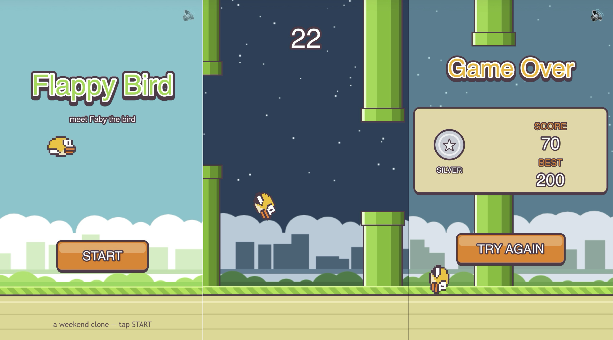

# 🐤 Flappy Bird — Faby

**🎮 [Play it now](https://flappy-bird-hanoimail-6658s-projects.vercel.app)** — works on desktop and mobile.

A browser-based Flappy Bird clone built in a weekend. You control **Faby**, a bird who
constantly moves to the right — tap, click, or hit the space bar to flap through the
gaps between green pipes. Touch a pipe or the ground and you're knocked out. The game
is endless; the only goal is a higher score.

Built with **vanilla JavaScript + HTML5 Canvas** — no frameworks, no build step, no
image or audio assets. All pixel art is drawn procedurally on canvas and all sound
effects are synthesized with the Web Audio API.



See [docs/1-spec.md](docs/1-spec.md) for the full game specification.

## Features

- 🎨 Procedural pixel art — Faby, pipes, ground, clouds, and skyline, all drawn in code
- 🔊 Web Audio sound effects — flap, milestone ding every 10 pipes, hit smack, ground thud
- 💥 Physical impact effects — knockback recoil off pipes, tumble rotation, dampened
  ground bounce, screen shake, white flash, feather bursts and dust puffs, squash &
  stretch, and a near-miss whoosh when you graze a pipe
- 📈 Progressive difficulty — the pipe gap tightens (160 → 132 px between scores 10
  and 60), scroll speed rises (225 → 350 px/s between scores 30 and 130), pipe
  spacing shrinks (320 → 220 px between scores 50 and 150), past 120 the pipes
  start swaying vertically (up to ±36 px), and the course shape itself ramps —
  gentle gap steps early, forced ≥ 24 px moves with dives up to 110 px late;
  all tunable via the `DIFFICULTY` config
- 🌙 Day → night cycle — the sky crossfades to a starry night as your score climbs,
  cycling back to day every 40 points
- 📱 Adaptive screen — portrait phones get the original tall view (~1 pipe visible),
  desktops get a wide 800×600 view (2–3 pipes); identical difficulty on both
- 🖥️ Crisp on high-DPI/Retina displays (`devicePixelRatio`-aware rendering)
- 🏅 Medals (Bronze / Silver / Gold / Platinum at 25 / 50 / 100 / 150 points) and a
  best score persisted in `localStorage` — it lives in the player's browser, so
  redeployments never reset it
- ⚙️ Delta-time physics (consistent speed on 60 Hz and 144 Hz monitors) and pipe
  object pooling (no GC stutter)
- 🌍 Global leaderboard for your friend group — one Redis sorted set
  behind two Vercel serverless functions, with a run-duration plausibility check
  (see below). No Redis? The game plays exactly the same; the leaderboard UI
  simply doesn't appear.

## Controls

| Input | Action |
|---|---|
| `Space` / mouse click / tap | Flap |
| `P` | Pause / resume (auto-pauses when the window loses focus) |
| `R` | Restart after game over |
| `M` / click 🔊 icon | Mute / unmute (remembered in `localStorage`) |
| 🏆 button | Leaderboard (title & game-over screens); `Esc` closes. Only shown when the optional backend is set up |

## Run locally

No build step, no dependencies. The easiest way: **double-click `index.html`**
(or drag it into a browser) — the game just runs. The
[global leaderboard](#global-leaderboard-optional) is optional and needs a
deployed backend; without one the game plays identically, with no errors — the
🏆 button just doesn't appear.

No sound? See [Troubleshooting](#troubleshooting).

## Project structure

```
├── index.html       # page shell + canvas + name-entry overlay
├── style.css        # centered dark layout, mobile/touch rules
├── game.js          # the entire game (physics, rendering, audio, states)
├── package.json     # redis client for the API functions (game itself has no deps)
├── api/
│   ├── run.js           # GET: signed run-start token (for the plausibility check)
│   └── leaderboard.js   # GET: top 10 · POST: submit a score
└── docs/
    ├── 1-spec.md    # game specification
    ├── screens.png  # screenshots of this clone
    └── flappy-bird-screens.jpg  # original game reference screens
```

## Tuning

All gameplay knobs are constants at the top of [game.js](game.js): gravity, flap
impulse, pipe speed/gap/spacing, and the impact-physics values (knockback strength,
bounce restitution, spin rate) in `die()` and the `DYING` branch of `update()`.

## Deploy to Vercel

This is a pure static site (plus the optional leaderboard functions), so it deploys
with zero configuration — no framework preset, no build command, no output
directory, no `vercel.json`. Deployment goes through **Git integration**: every
push deploys automatically.

### Prerequisites

1. **A Vercel account** — the free Hobby plan is enough: [vercel.com/signup](https://vercel.com/signup).
2. **Make the game public** — new Vercel projects ship with **Deployment Protection
   (Vercel Authentication) enabled**, so visitors get a Vercel login wall instead of
   the game. To let anyone play: in the Vercel dashboard go to your project →
   **Settings → Deployment Protection → Vercel Authentication** and set it to
   **Disabled** (or scope it to *Only Preview Deployments* if you want preview URLs
   to stay private while the production URL is public). There's nothing sensitive in
   a static game, so disabling it is fine.

### Deploy via Git integration

1. Push this folder to a GitHub/GitLab/Bitbucket repository.
2. Go to [vercel.com/new](https://vercel.com/new) and **Import** the repository.
3. Leave everything as detected:
   - **Framework Preset**: `Other`
   - **Build Command**: *(empty)*
   - **Output Directory**: *(empty — serves the repo root)*
4. Click **Deploy**.

Every push to the default branch now deploys to production automatically, and every
pull request gets its own preview URL.

## Global leaderboard (optional)

A tiny global board for a small friend group. Each player's **personal best** is
kept in one Redis sorted set; two serverless functions serve it.

**Entirely optional.** The game detects at load whether the leaderboard API is
reachable. Without it — playing the plain `index.html`, a static server, or a
deploy with no database — the game runs exactly the same with no errors; the 🏆
button, name prompt, and score submission simply don't exist.

**How it works**

- On game over (score ≥ 1) the game submits your best under your nickname. You're
  asked for a name once (stored in `localStorage`); change it any time via the 🏆
  panel → "tap to change".
- Names are **honor system** — whoever submits under a name shares that entry, so
  agree on names in the group chat.
- **Plausibility check**: when a run starts, the game fetches a signed timestamp
  token (`GET /api/run`). On submit, the server derives the run's true wall-clock
  duration from it and rejects scores that are physically impossible for that time
  (based on max pipe rate) — enough to stop casual `curl` pranks.
- If the API becomes unreachable mid-session, everything degrades gracefully —
  fetches are swallowed and the game is unaffected.

**Setup (one-time)**

1. **Create the database**: in the [Vercel dashboard](https://vercel.com/dashboard),
   open **Marketplace** (or your project → **Storage** tab) → search for
   **Upstash** → **Upstash for Redis** → create a free database. No separate
   Upstash account is needed — Vercel provisions and manages it.
2. **Connect it to this project**: during creation (or later from the database's
   page → *Projects*), connect the database to the `flappy-bird` project. This
   automatically adds the credentials to the project's **environment variables**
   (Project → Settings → Environment Variables) — you'll see
   `KV_REST_API_URL`, `KV_REST_API_TOKEN`, `KV_URL`, `REDIS_URL`, etc. The API
   functions read `KV_REST_API_URL` / `KV_REST_API_TOKEN` (and also accept the
   newer `UPSTASH_REDIS_REST_*` names).
3. **Nothing to copy for production** — since the env vars are already on the
   project, deployed functions just work. You only need a local copy of the keys
   (as `.env.local`, downloadable from the database page or via
   `vercel env pull .env.local`) if you want to run the API locally with
   `vercel dev`. `.env*` files are gitignored — never commit them; the tokens
   grant full read/write to the database.
4. Optionally add an `LB_SECRET` env var (any random string) to sign run tokens —
   otherwise the Redis token doubles as the signing secret.
5. **Redeploy** (push any commit): env vars only take effect on the next
   deployment. Done — no schema, no migrations.

Verify it's live:

```bash
curl https://<your-app>.vercel.app/api/leaderboard
# {"board":[]}  -> working; play a run and your name will appear
# {"error":"leaderboard not configured"} -> env vars missing; check step 2, redeploy
```

For local development, a plain static server serves the game fine — the
leaderboard UI just won't appear (no functions). Use `vercel dev` (with
`.env.local` present) to run the functions locally too.

## Troubleshooting

All of these are about sound — the game itself runs everywhere.

**Check the 🔊 icon first** (title and game-over screens):

| Icon | Meaning |
|---|---|
| Solid 🔊 | Audio engine is running — if it's still silent, the problem is outside the page (tab mute, volume, silent switch). |
| Translucent 🔊 | The browser is blocking audio — see the cases below. |
| 🔇 | Muted in-game — press `M` or click the icon. |

**No sound in Safari on Mac (local file)** — Safari blocks Web Audio on pages
opened via `file://` (the game shows a small hint under the icon). Chrome
doesn't have this restriction. Play the deployed URL, or serve the folder over
a tiny local server:

```bash
npx serve .              # then visit http://localhost:3000
# or
python3 -m http.server   # then visit http://localhost:8000
```

**No sound on iPhone (Safari or Chrome — both are WebKit)** — the game switches
its audio session to *playback* so the Ring/Silent switch shouldn't mute it,
but if you still hear nothing:

1. Tap the screen once (browsers only unlock audio after a user gesture).
2. Press the volume-up button *while the game tab is open* — media volume is
   separate from ringer volume.
3. Check the Ring/Silent switch and Control Center mute.
4. Make sure a Focus mode isn't silencing media.

**Still silent in desktop Safari (served over HTTP)** — check
Safari → Settings → Websites → Auto-Play for the site and set
**"Allow All Auto-Play"**, and look for the tab-mute speaker icon in the
address bar.
